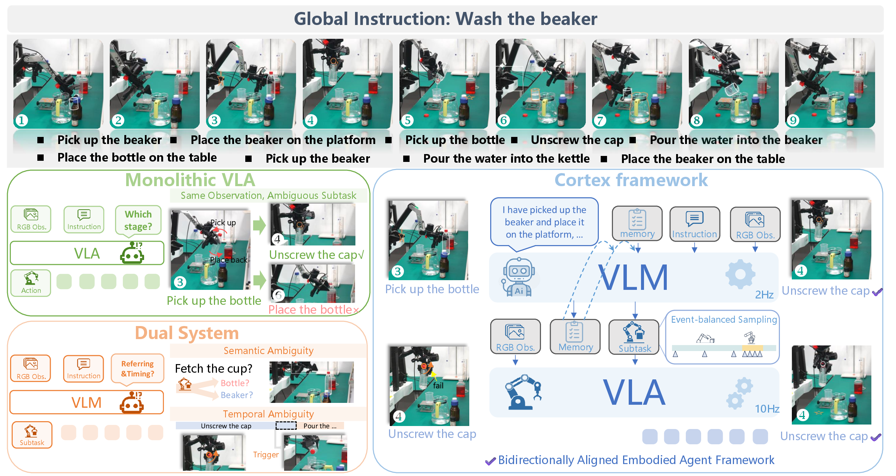
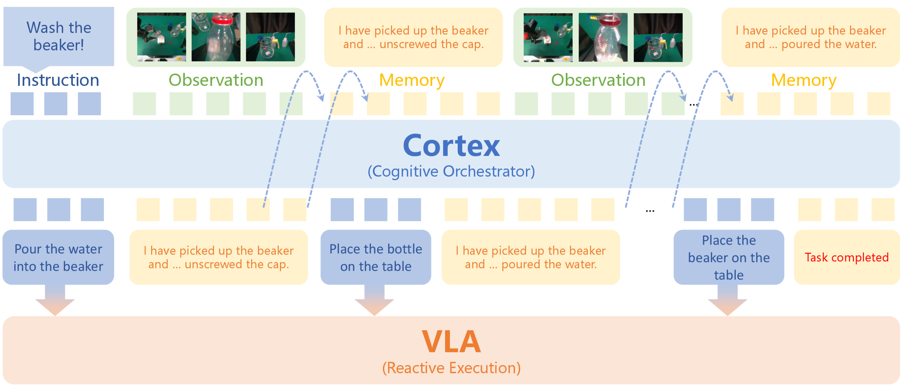
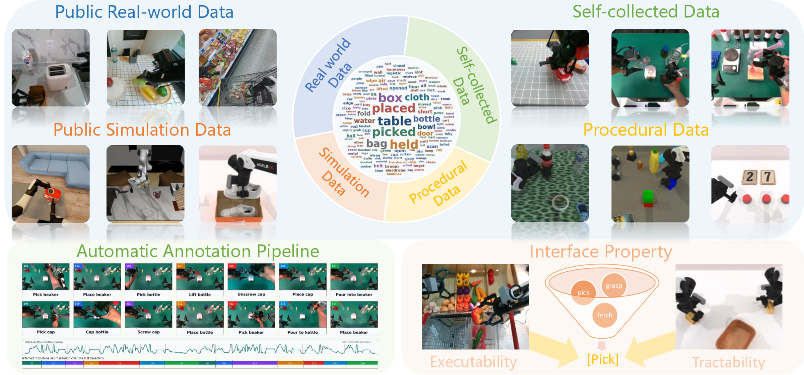
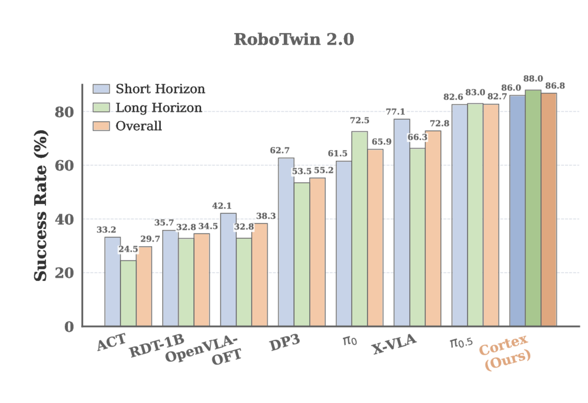
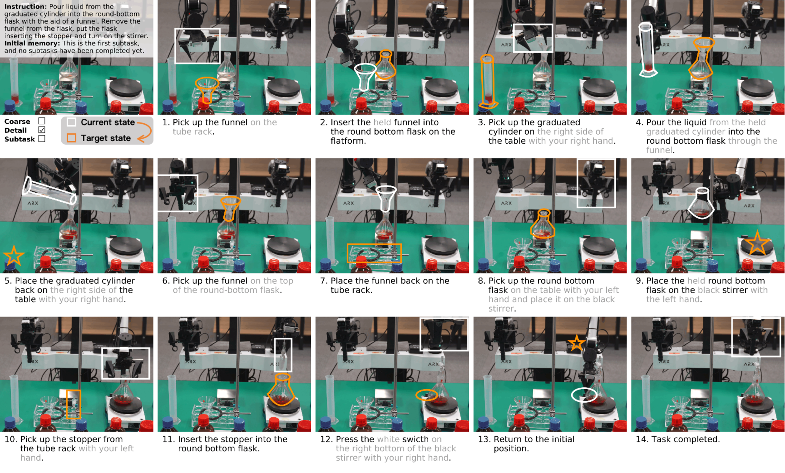

<div align="center">

# Cortex

### A Bidirectionally Aligned Embodied Agent Framework for Long-horizon Manipulation


[**Project Page**](https://steinate.github.io/cortex.github.io/) &nbsp;|&nbsp;
[**Paper**](https://arxiv.org/abs/2607.05377) &nbsp;|&nbsp;
[**GitHub**](https://github.com/steinate/Cortex) &nbsp;|&nbsp;
[**Website Source**](https://github.com/steinate/cortex.github.io) &nbsp;|&nbsp;
[**Video**](#video)

Jiaqi Peng\*, Xiqian Yu\*, Delin Feng\*, Yuqiang Yang, Wenzhe Cai, Jing Xiong, Ganlin Yang, Jinliang Zheng, Jiafei Cao, Xueyuan Wei, Jiangmiao Pang, Yuan Shen†, Tai Wang†

Tsinghua University · Shanghai AI Laboratory · Peking University · USTC



</div>

Cortex is a bidirectionally aligned embodied agent framework for long-horizon manipulation. The core idea is to let a high-level VLM act as a cognitive orchestrator that tracks progress, updates semantic memory, and emits executable subtasks, while a low-level VLA focuses on reactive physical execution.


## Video

<div align="center">
<video src="assets/cortex-demo.mp4" width="92%" controls muted loop playsinline></video>
<br>
<a href="assets/cortex-demo.mp4"><b>Open demo video</b></a>
<br>
<sub><b>Cortex in action.</b> Closed-loop long-horizon manipulation with executable subtask routing, compact memory, and online progress verification.</sub>
</div>


## At a Glance

| Question | Cortex answer |
| --- | --- |
| Why do monolithic VLAs fail on long-horizon manipulation? | They are largely Markovian: the policy often sees the current observation but lacks reliable progress memory and transition verification. |
| What does Cortex add? | A System-2 VLM that continuously predicts the current subtask and active language memory for a System-1 executor. |
| What makes the interface executable? | Subtasks are standardized around canonical manipulation skills and grounded with object attributes, spatial relations, counts, and reachability-aware constraints. |
| How is temporal ambiguity handled? | Event-balanced training teaches the VLM to keep the same subtask during ongoing execution and update memory only at verified transition boundaries. |

## Content

1. **Motivation.** End-to-end VLAs are strong at local reactive control, yet struggle when the task requires progress tracking, repeated objects, long causal chains, or visual states that differ only subtly.

2. **Interface formulation.** Cortex introduces a subtask-memory interface between System-2 and System-1. The high-level planner predicts the current executable subtask and the active language memory; the low-level executor receives a localized manipulation objective.

3. **Metadata construction.** Long-horizon trajectories are converted into standardized subtask annotations. The interface is designed to be both executable, by mapping to canonical skills, and tractable, by incorporating reachability and task-order priors.

4. **Training.** Event-balanced sampling separates ongoing execution frames from transition frames, so the VLM learns both semantic patience and boundary-triggered memory updates.

5. **Evaluation.** The paper evaluates System-2 planning with step-level and episode-level protocols, then studies the complete dual-system behavior in simulation and real-world long-horizon tasks.

## Main Contributions

<div align="center">

<br>
<sub><b>Architecture.</b> System-2 observes the scene and language memory, then streams executable subtasks to System-1.</sub>
</div>

**A bidirectionally aligned agent framework.** Cortex aligns high-level cognitive planning with low-level manipulation execution through a shared subtask interface.

**A standardized long-horizon subtask space.** The paper standardizes manipulation behavior into 32 canonical skill primitives and augments subtasks with spatial, numerical, and object-attribute grounding.

**Event-balanced System-2 training.** Instead of only sampling uniformly from trajectories, Cortex emphasizes transition regions where the planner must verify completion and update memory.

**Closed-loop long-horizon deployment.** In real-world chemistry-style tasks, Cortex uses memory and visual verification to preserve task order, avoid premature switching, and recover from local execution ambiguity.

## Cortex Suite

The dataset construction pipeline combines public real-world trajectories, public simulation data, self-collected robot data, and procedural simulation. The goal is not only to describe what happened in a trajectory, but to produce a subtask interface that can be consumed by a robot policy.

<div align="center">

<br>
<sub><b>Metadata construction.</b> Long-horizon trajectories are standardized into executable and tractable subtask metadata.</sub>
</div>

## Evaluation Overview

The paper evaluates Cortex from three complementary angles.

| Evaluation | Purpose |
| --- | --- |
| System-2 step-level evaluation | Measures whether the VLM predicts the correct subtask and memory when given ground-truth memory. |
| System-2 episode-level evaluation | Measures closed-loop semantic drift when the VLM consumes its own previous memory. |
| Dual-system simulation and real-world evaluation | Measures whether System-2 guidance improves full long-horizon execution when paired with a VLA executor. |

The System-2 evaluation is organized around spatial grounding, long-horizon logical consistency, and object counting accuracy. The full system is evaluated on long-horizon simulation suites and zero-shot real-world manipulation tasks.

<div align="center">

<br>
<sub><b>Simulation.</b> Cortex improves long-horizon task execution by providing explicit subtask routing and progress verification.</sub>
</div>

## Real-world Long-horizon Deployment

The real-world experiments emphasize capabilities that are difficult to obtain from monolithic end-to-end policies: preserving procedural order, verifying completion before switching, using memory to disambiguate similar visual stages, and adapting to local execution uncertainty.

<div align="center">

<br>
<sub><b>Real-world deployment.</b> Zero-shot multi-stage chemistry task with fine-grained subtask prediction and memory tracking.</sub>
</div>

## Roadmap

- Paper and project page preview
- System-2 model card
- System-2 inference examples
- Step-level and episode-level evaluation scripts
- Checkpoints and data cards
- Full documentation for pairing Cortex with a System-1 executor

## Project Layout

This preview repository currently contains only the project README and representative assets. The implementation repository will follow the paper components: System-2 training, System-2 inference, evaluation, model serving, and visualization.

## Citation

If you find this project useful, please cite:

```bibtex
@misc{peng2026cortex,
  title={Cortex: A Bidirectionally Aligned Embodied Agent Framework for Long-horizon Manipulation},
  author={Jiaqi Peng and Xiqian Yu and Delin Feng and Yuqiang Yang and Wenzhe Cai and Jing Xiong and Ganlin Yang and Jinliang Zheng and Jiafei Cao and Xueyuan Wei and Jiangmiao Pang and Yuan Shen and Tai Wang},
  year={2026},
  eprint={2607.05377},
  archivePrefix={arXiv},
  url={https://arxiv.org/abs/2607.05377}
}
```
